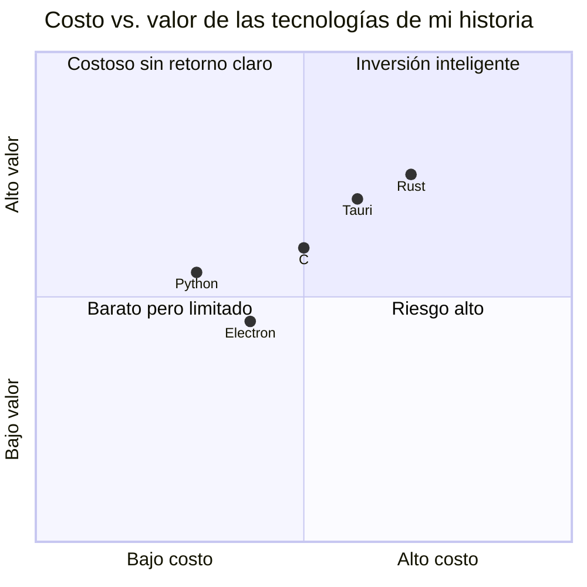
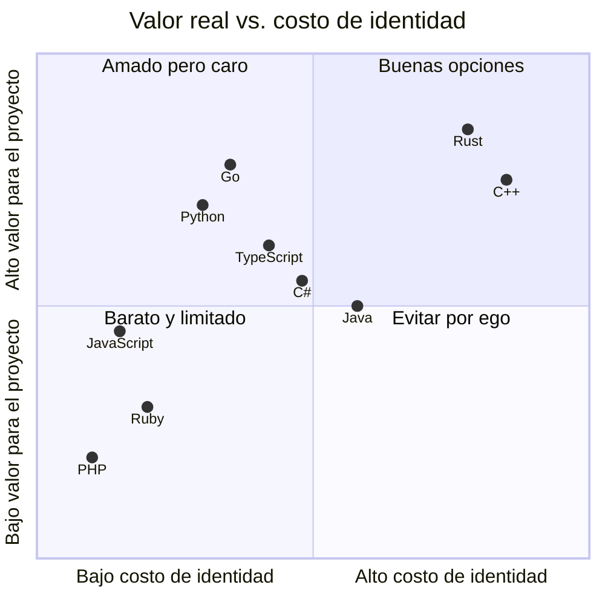

Este es un post que llevo planeando escribir desde hace tiempo, porque es un problema que aparece cada vez que se crea un proyecto nuevo. ¿Qué lenguaje uso?

El primer pensamiento que me llega no tiene que ver con los lenguajes en sí. Tiene que ver con qué se hace con ellos. **Al final son tecnologías que te ayudan a transformar información que entra y sale de tu sistema.** Eso es todo.

## La vez que elegí Rust por el ego

Me llegó un proyecto para un hotel: firmar tarjetas [NFC](https://nfc-forum.org/learn/nfc-technology/) y darles acceso a los cuartos. El desarrollador anterior les cobraba mucho por darle soporte, y la idea era abaratar el costo. Era: yo contra el vato que quería seguir dando soporte.

[Tauri](https://v1.tauri.app/) se estaba desarrollando en ese entonces y prometía que las aplicaciones desktop iban a ser más ligeras que las de [Electron](https://www.electronjs.org/). Cumplía. Pero lo que me llevó a elegirlo más allá de la promesa, creo que fue el ego. **Quería usar la mayor cantidad de lenguajes posibles.** Ser programador formaba parte de mi identidad como desarrollador, como persona. Con cinco años de experiencia, pero con una actitud muy junior.

[Rust](https://rust-lang.org/) era la elección correcta sobre el papel. [Tauri](https://v1.tauri.app/) escupe una app desktop ligera, el lenguaje es sólido, la comunidad crece. Todo bien.

Pero me topé con un problema que [Rust](https://rust-lang.org/) no resolvía: necesitaba un sidecar que corriera junto con [Arduino](https://www.arduino.cc/) para leer el puerto COM. Etapa de desarrollo, lejos de producción, pero real. Dije "pues ejecuto el código [C](https://www.c-language.org/) junto con la aplicación desktop". Era una buena opción sobre el papel.

No resultó como esperaba. En [VS Code](https://code.visualstudio.com/) tenía muchos problemas para correr el sidecar. Al final tenía un script en [Python](https://www.python.org/) para armar el bundle: la app de [Tauri](https://v1.tauri.app/) con el sidecar que leía el puerto COM y lo que venía después de manejar microcontroladores. También estaba entrenando a un compañero recién llegado en [Rust](https://rust-lang.org/), [Svelte](https://svelte.dev/), [Arduino](https://www.arduino.cc/) y varias tecnologías.

**Terminó siendo un amalgama de tecnologías.** Todo por el costo de tratar de aprender un lenguaje nuevo en vez de abaratar el costo de implementación.

## La elección como identidad

Esa experiencia me dejó clara una cosa: la elección de un lenguaje se vuelve una cuestión de identidad. "Yo soy programador de [Python](https://www.python.org/)", "yo hago [Rust](https://rust-lang.org/)", "[Go](https://go.dev/) es lo único que sirve". Nos ponemos etiquetas como si fueran parte de quiénes somos.

Steve Francia escribió dos posts sobre esto en noviembre del 2025: [Why Engineers Can't Be Rational About Programming Languages](https://spf13.com/p/the-hidden-conversation/) y [The 9 Cost Factors](https://spf13.com/p/the-9-factors/). En el primero explica que toda discusión de lenguajes tiene dos conversaciones al mismo tiempo: la visible (features, benchmarks, tipos) y la invisible (identidad, ego, pertenencia). La invisible casi siempre gana.

Su punto no es nuevo, pero está bien dicho: **la decisión correcta no es la que te hace sentir mejor como ingeniero, es la que le conviene al proyecto.**

## Entonces, ¿cómo se elige?

Si quitamos la identidad del medio, la pregunta se simplifica: ¿qué información transforma mi sistema y qué herramienta me conviene para eso?

Los 9 factores de Francia se agrupan en tres dominios:

- **Construir**: qué tan rápido escribes, qué tan fácil escala el código, cuánto tarda alguien nuevo en ser productivo
- **Ejecutar**: cuánto cuesta mantener, cuánto consume en runtime, qué tan rápido despliegas
- **Externos**: cómo interactúa con otras herramientas, qué tan bien funciona con asistencia de IA, qué tan seguro es el ecosistema

Ninguno de estos factores dice "este lenguaje es el mejor". Todos dicen "este lenguaje cuesta X en estas condiciones".

## En la práctica

Cuando empiezas un proyecto nuevo, antes de abrir el debate del lenguaje, responde esto:

1. ¿Qué información entra y sale de mi sistema?
2. ¿Qué tan rápido necesito tener algo funcionando?
3. ¿Quién más va a trabajar en esto?
4. ¿Cuánto cuesta mantener esto en un año?

Las respuestas te van a acercar más a la decisión correcta que cualquier benchmark que encuentres en internet.

No digo que la elección sea trivial. Digo que no debería ser una discusión sobre quién tiene la razón. **Es una decisión económica, y las decisiones económicas se toman con datos, no con ego.**

Lo que Steve llama la "conversación invisible" es real, y funciona en tu contra incluso cuando crees que estás siendo racional. La próxima vez que alguien (o tú) defienda un lenguaje con pasión, pregúntate: ¿estoy evaluando una herramienta o estoy defendiendo una versión de mí mismo?

## Los lenguajes por los que nos identificamos

Estos son los lenguajes donde más desarrolladores han formado una identidad, posicionados por su valor real cuando respondes las 4 preguntas de arriba:

El costo de identidad es lo que te cuesta la decisión cuando dejas que el ego hable en vez de los datos: tiempo de aprendizaje, contratación difícil, mantenimiento complejo, o simplemente la frustración de forzar una herramienta donde no encaja.

**Rust y C++ dan alto valor, pero cuestan caro en identidad** (curva de aprendizaje, talento escaso). Go y Python están en la zona donde el costo justifica el retorno si las preguntas de arriba se responden bien. C# y Java son el terreno enterprise: ecosistema maduro, herramientas sólidas, valor predecible. PHP y Ruby se justifican solo si el proyecto ya está atado a ellos.

La posición no es universal. Cambia según tu proyecto, tu equipo y tu sistema. **Esto es solo un ejercicio didáctico**, mi forma de ver las cosas en este preciso momento, no una ley ni una verdad absoluta. Es un blog, después de todo. Y sí, tal vez estoy actuando con mi ego al posicionar uno u otro más abajo o arriba de lo que me gustaría. Ese es exactamente el punto.
