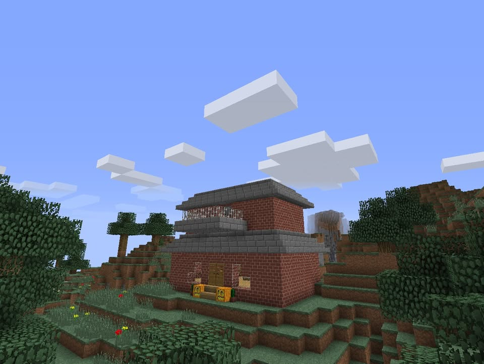
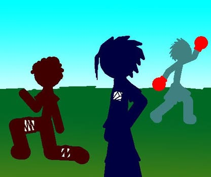
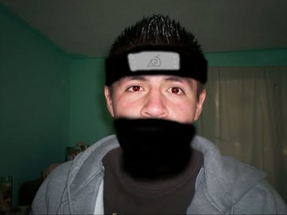
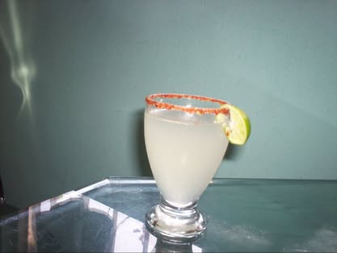
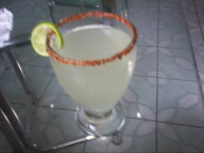
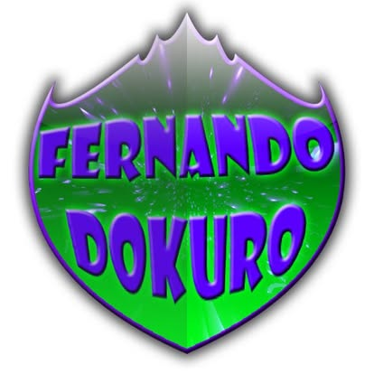
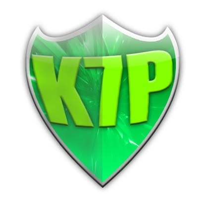
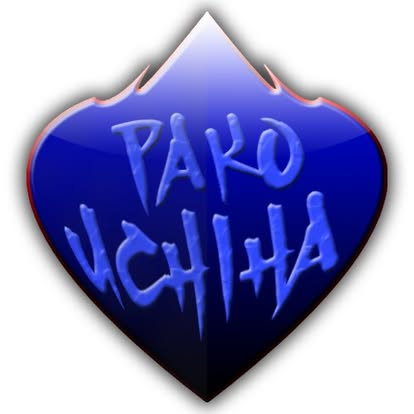
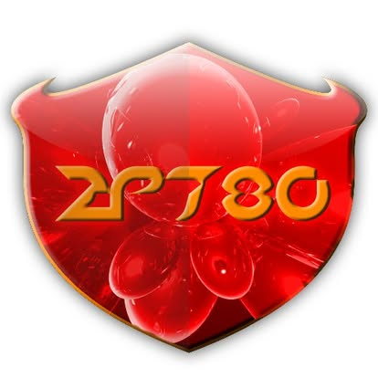

En 2011 estaba aprendiendo Photoshop y jugando Minecraft. Este álbum reúne lo que hacía en ese entonces: un mundo de ladrillo en Minecraft, fan art de anime, siluetas con degradados, la limonada que hice una tarde y escudos que diseñé para algunos amigos.

<figure style="margin:0;">

<figcaption style="font-size:0.8rem; color:var(--text-faint); text-align:center; margin-top:4px;">Mi casa en Minecraft — ladrillo rojo y techo de losa de piedra</figcaption>
</figure>

<figure style="margin:0;">

<figcaption style="font-size:0.8rem; color:var(--text-faint); text-align:center; margin-top:4px;">Fan art de L (Death Note) — Photoshop con textos estilizados</figcaption>
</figure>

<figure style="margin:0;">

<figcaption style="font-size:0.8rem; color:var(--text-faint); text-align:center; margin-top:4px;">Siluetas — primeros intentos con el lazo y degradados</figcaption>
</figure>

<figure style="margin:0;">

<figcaption style="font-size:0.8rem; color:var(--text-faint); text-align:center; margin-top:4px;">Mi hermano editado con headband de Konoha</figcaption>
</figure>

<figure style="margin:0;">

<figcaption style="font-size:0.8rem; color:var(--text-faint); text-align:center; margin-top:4px;">La limonada que hice — borde de tajín y todo</figcaption>
</figure>

<figure style="margin:0;">

<figcaption style="font-size:0.8rem; color:var(--text-faint); text-align:center; margin-top:4px;">Otra toma — la mesa de hace muchísimo tiempo</figcaption>
</figure>

<figure style="margin:0;">

<figcaption style="font-size:0.8rem; color:var(--text-faint); text-align:center; margin-top:4px;">Escudo para Fernando Dokuro</figcaption>
</figure>

<figure style="margin:0;">

<figcaption style="font-size:0.8rem; color:var(--text-faint); text-align:center; margin-top:4px;">Escudo para K7P</figcaption>
</figure>

<figure style="margin:0;">

<figcaption style="font-size:0.8rem; color:var(--text-faint); text-align:center; margin-top:4px;">Escudo para Pako Uchiha</figcaption>
</figure>

<figure style="margin:0;">

<figcaption style="font-size:0.8rem; color:var(--text-faint); text-align:center; margin-top:4px;">Escudo para 2P780</figcaption>
</figure>

### Comentarios

<!-- Captura de comentarios de Facebook — ejecutar: python scripts/fb_comments_screenshot.py -->

[Ver álbum completo en Facebook](https://www.facebook.com/media/set/?set=a.114766901923364&type=3)
