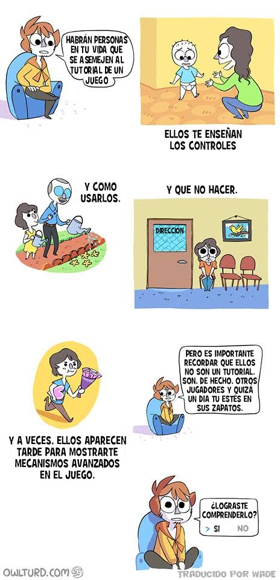

Esta tira de [owlturd](https://owlturd.com) me pareció genial. **La idea es que las personas que te ayudan en la vida son como el tutorial de un videojuego.** Te enseñan los controles, qué hacer y qué no hacer. Pero no son un tutorial, son otros jugadores. Y quizá un día estés en ese lugar, de ser el "tutorial". Hay que prepararse.

Se me hizo cool porque con el paso del tiempo uno tiende a creer que siempre le van a ayudar, pero en realidad uno se traslada hacia la otra parte poco a poco. Y a uno le va a tocar.

