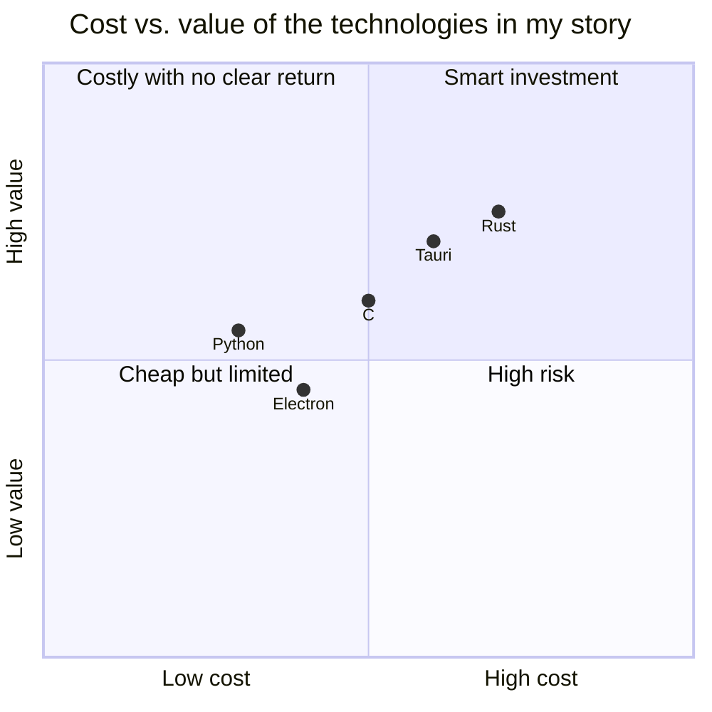
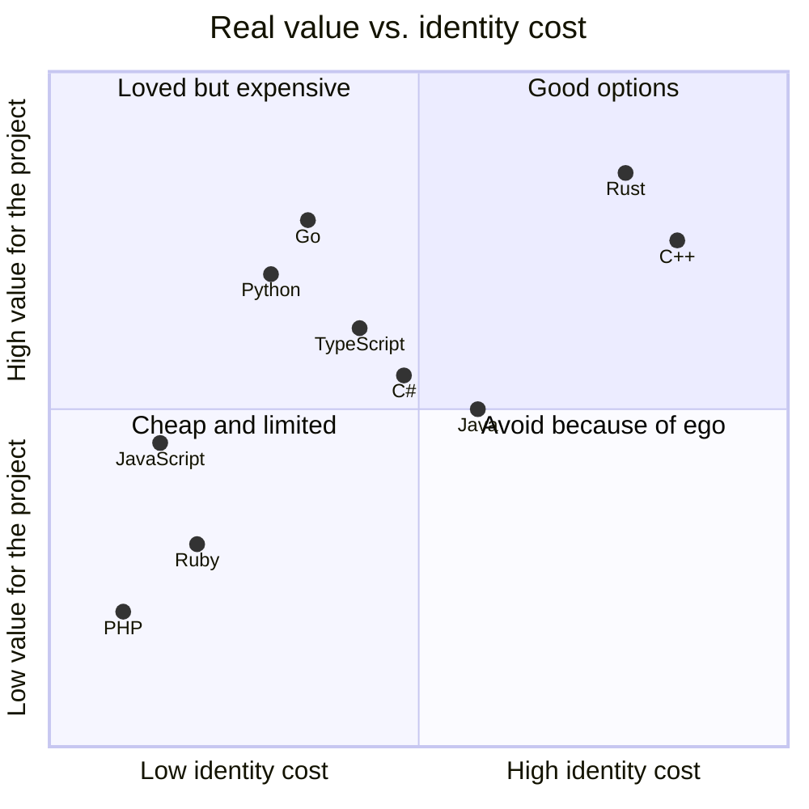

This is a post I've been planning to write for a while, because it's a problem that comes up every time a new project gets created. What language do I use?

The first thought that comes to me isn't about the languages themselves. It's about what you do with them. **In the end they're technologies that help you transform information that enters and leaves your system.** That's all.

## The time I picked Rust for the ego

I got a project for a hotel: sign [NFC](https://nfc-forum.org/learn/nfc-technology/) cards and give them access to the rooms. The previous developer charged them a lot for support, and the idea was to lower the cost. It was: me against the guy who wanted to keep providing support.

[Tauri](https://v1.tauri.app/) was being developed at the time and promised that desktop apps would be lighter than [Electron](https://www.electronjs.org/) ones. It delivered. But what pushed me to pick it beyond that promise, I think, was ego. **I wanted to use as many languages as possible.** Being a programmer was part of my identity as a developer, as a person. Five years of experience, but with a very junior attitude.

[Rust](https://rust-lang.org/) was the right choice on paper. [Tauri](https://v1.tauri.app/) spits out a lightweight desktop app, the language is solid, the community is growing. All good.

But I ran into a problem that [Rust](https://rust-lang.org/) didn't solve: I needed a sidecar that ran alongside [Arduino](https://www.arduino.cc/) to read the COM port. Development stage, far from production, but real. I said "well I'll just run the [C](https://www.c-language.org/) code next to the desktop app." It was a good option on paper.

It didn't work out the way I expected. In [VS Code](https://code.visualstudio.com/) I had a lot of trouble running the sidecar. In the end I had a [Python](https://www.python.org/) script to assemble the bundle: the [Tauri](https://v1.tauri.app/) app with the sidecar reading the COM port, plus whatever came after dealing with microcontrollers. I was also training a new teammate on [Rust](https://rust-lang.org/), [Svelte](https://svelte.dev/), [Arduino](https://www.arduino.cc/) and a bunch of other tech.

**It ended up being a hodgepodge of technologies.** All because I was trying to learn a new language instead of lowering the implementation cost.

## The choice as identity

That experience made one thing clear to me: choosing a language becomes an identity question. "I'm a [Python](https://www.python.org/) programmer", "I do [Rust](https://rust-lang.org/)", "[Go](https://go.dev/) is the only thing that works". We label ourselves like these things are part of who we are.

Steve Francia wrote two posts about this in November 2025: [Why Engineers Can't Be Rational About Programming Languages](https://spf13.com/p/the-hidden-conversation/) and [The 9 Cost Factors](https://spf13.com/p/the-9-factors/). In the first he explains that every language discussion has two conversations at the same time: the visible one (features, benchmarks, types) and the invisible one (identity, ego, belonging). The invisible one almost always wins.

His point isn't new, but it's well said: **the right decision isn't the one that makes you feel better as an engineer, it's the one that suits the project.**

## So, how do you choose?

If you take identity out of the equation, the question gets simpler: what information does my system transform, and what tool works for that?

Francia's 9 factors group into three domains:

- **Building**: how fast you write, how easily the code scales, how long it takes someone new to be productive
- **Running**: how much it costs to maintain, how much it consumes at runtime, how fast you deploy
- **External**: how it interacts with other tools, how well it works with AI assistance, how safe the ecosystem is

None of these factors says "this language is the best". They all say "this language costs X under these conditions".

## In practice

When you start a new project, before opening the language debate, answer this:

1. What information enters and leaves my system?
2. How fast do I need something working?
3. Who else is going to work on this?
4. How much does it cost to maintain this in a year?

These answers will get you closer to the right decision than any benchmark you find on the internet.

I'm not saying the choice is trivial. I'm saying it shouldn't be a debate about who's right. **It's an economic decision, and economic decisions are made with data, not ego.**

What Steve calls the "invisible conversation" is real, and it works against you even when you think you're being rational. Next time someone (or you) defends a language with passion, ask yourself: am I evaluating a tool, or am I defending a version of myself?

## The languages we identify with

These are the languages where the most developers have formed an identity, ranked by their real value when you answer the 4 questions above:

Identity cost is what the decision costs you when you let ego talk instead of data: learning time, hard hiring, complex maintenance, or just the frustration of forcing a tool where it doesn't fit.

**Rust and C++ give high value, but they're expensive in identity** (learning curve, scarce talent). Go and Python sit in the zone where the cost justifies the return if the questions above are answered well. C# and Java are the enterprise ground: mature ecosystem, solid tools, predictable value. PHP and Ruby only justify themselves if the project is already locked into them.

The position isn't universal. It changes with your project, your team, and your system. **This is just a teaching exercise**, my way of seeing things at this exact moment, not a law or an absolute truth. It's a blog, after all. And yeah, maybe I'm letting my ego show when I rank one lower or higher than I'd like. That's exactly the point.
