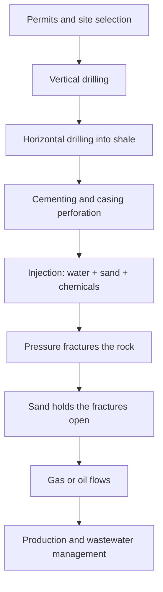
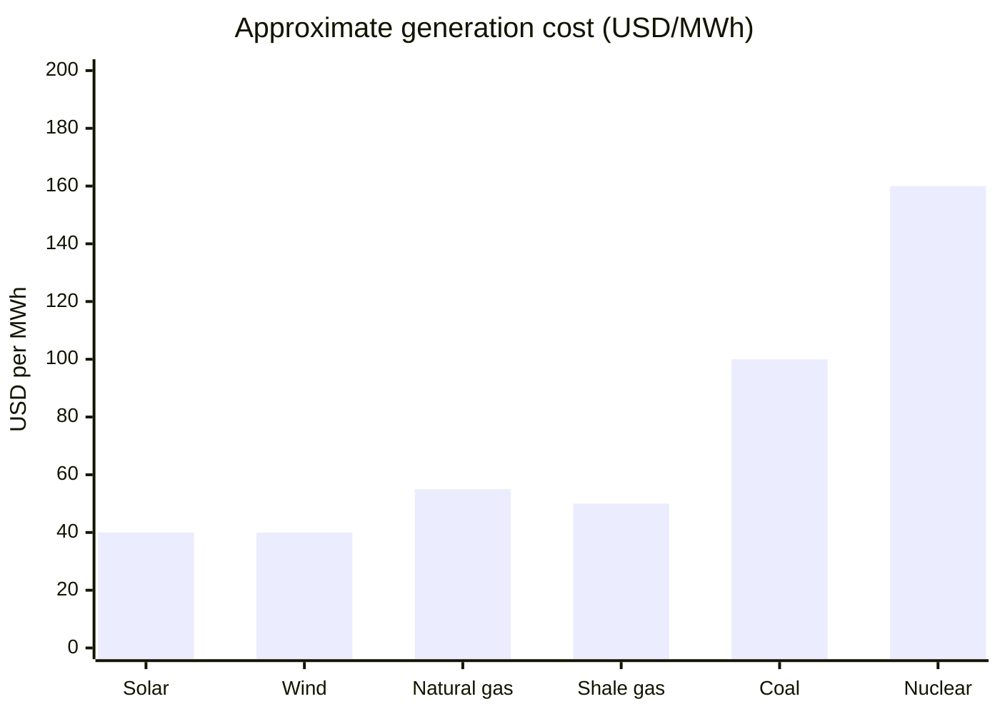
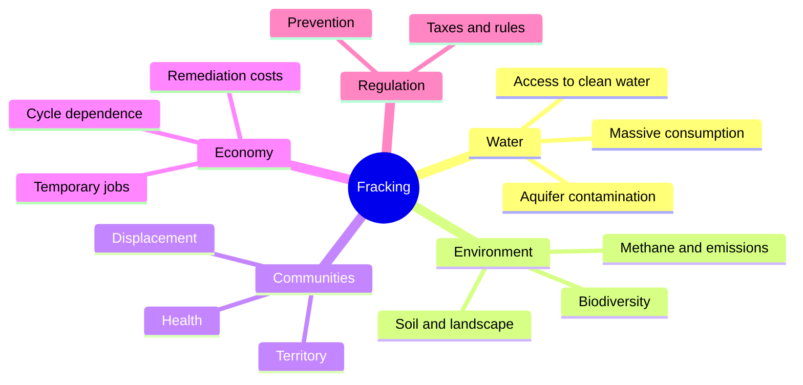

<video controls src="/static/posts/mooh-kemouche-11y-reply-see-trans_v0.mp4" style="width:100%; max-height:600px; border-radius:4px;"></video>

I don't know how I came across [this post](https://www.facebook.com/watch/?v=10153054829609308). I guess I was following some Photoshop page, but for some reason it popped up like I had shared it. It talks about [fracking](https://en.wikipedia.org/wiki/Hydraulic_fracturing), a topic that was heavily discussed in 2015 because they wanted to implement it in Mexico.

Recently the channel CuriosaMente uploaded another video on the same thing: [How does fracking work... and what are its consequences](https://www.youtube.com/watch?v=7RpEBwr0IeU). **11 years have passed since this post and fracking is still unresolved.**

The important thing here is to understand. Beyond acting or banning it, you need to know what fracking is and what it involves. Without that, the discussion stays stuck at the slogan level.

## How fracking works

These are clear technical steps, not a slogan. From permit to production:

## The cost compared to other sources

It's not the cheapest option. The chart uses orders of magnitude in USD per MWh; ranges vary by region and year:

## What fracking touches

The well is just the beginning. What else is on the same network:

## My proposal

Fracking shouldn't happen. But **banning it isn't enough**: the technology already exists, and so does the idea. If a crisis hits and it's the only solution, a total veto just buys us time we don't get back.

I propose legislating for those cases: crisis or daily use, with clear rules. I don't know how to legislate, I'll admit it. The government tends to ban things and then rig the rules so companies win. Whoever gets there first writes the rules.

If they've already arrived, we need to push prevention ideas from our side. Don't let them take away our access to clean water or to communities. That, at a minimum.
