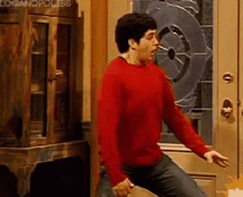

Back then I was kind of into cameras and photography. **This photo from [Hangingpixels Photo Art](https://www.facebook.com/hangingpixels) looked sick.** The author is [Oat Vaiyaboon](https://lumecube.com/blogs/ambassador/oat-vaiyaboon), an Australian photographer.

<iframe src="https://www.facebook.com/plugins/post.php?href=https%3A%2F%2Fwww.facebook.com%2Fhangingpixels%2Fposts%2Fpfbid0jdGR2MTLDEpbpKuupembkTngoJANph8XcyCZaSfo5PSAvkCxSEtp42VgbPBcZKsEl&width=500" title="Original Hangingpixels Photo Art post on Facebook" style="width:100%; max-width:500px; height:1000px; border:0;" frameborder="0"></iframe>

Facebook launched the 3D Photos feature in 2018, designed for portrait mode photos from dual-camera iPhones. The problem: it only worked with photos that already had a depth map generated by the phone's hardware.

**Vaiyaboon hacked the system.** He created his own depth map manually in Photoshop: each layer of the photo converted to grayscale with different opacities. Then he combined the original photo and the depth map with the iOS app [DepthCam](https://apps.apple.com/us/app/depth-cam-depth-editor/id1261191886) to generate a JPEG file with depth metadata that Facebook interprets as a portrait mode photo.

The depth map logic is simple: **darker = closer to the camera, lighter = farther away.**

  
100% black

  
80%

  
60%

  
40%

  
0% white

Foreground → Background. Each layer of the photo becomes a different gray in the depth map.

The result: DSLR and drone photos working as 3D Photos on Facebook. **It took him 12 attempts to get the depth map right.**

**Gear:** Canon 5D III, Canon 16-35mm f/2.8, Kase filters GND 0.9, CPL, ND64

**Resources:**

- [Tutorial by Marc Keegan](https://marckeegan.com/facebook-3d-photos/)
- [Coverage on Fstoppers](https://fstoppers.com/originals/hacking-portrait-mode-create-3d-parallax-photo-facebook-189359)
- [Coverage on PetaPixel](https://petapixel.com/2018/10/23/photographer-turns-drone-shot-into-a-facebook-3d-photo/)

I never tried this directly. I think I did try it later, but with After Effects stuff or something like that. I never got it to work publishing a photo on Facebook.
