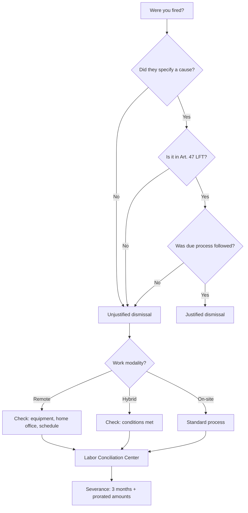

They changed my priorities. Not in the nice corporate sense of a "strategic pivot," but in the sense of sitting down on a Monday and being told your project no longer exists.

I worked at [ArkusNexus](https://www.arkusnexus.com/), a technology consulting firm. I had been on the [Drata](https://drata.com/) project for a year and seven months, and for the first time in a long while I felt stable. I already understood the project, the technologies, the dynamic with the team and with the consultancy. I was in that comfortable stage where you know how to move, where you stop asking basic questions, where you have the freedom to do things without asking permission.

And suddenly: **"Now you're on the research team."** No warning. First thing Monday morning I had the news. One day you're building, the next they tell you your role isn't the same. I accepted because I had no choice. People I believed would stay on the project turned out not to. Everything fell apart and the atmosphere became unbearable.

**A few days later came the dismissal.** Unjustified, with no real cause. The first thing I did was look up what I was entitled to under Mexican law. In Mexico, when you're wrongfully terminated, you're owed **severance** that includes three months' salary, prorated aguinaldo, vacation pay, and vacation premium, among other items. In the end they gave me about two-thirds of what they actually owed me. I was furious. I wanted to make a mess of things, but I didn't know where to start.

To understand what happened, you need to know that Mexico's Federal Labor Law<a href="#lft-ref" class="footnote-ref">1</a> distinguishes between justified and unjustified dismissal. Getting fired for stealing or for not showing up is not the same as getting fired without being told why. And in the context of software consultancies, where many of us work remotely or hybrid, things get more complicated:

I ended up going to the **Labor Conciliation Center** in Tijuana for advice. There they explained what I was and wasn't entitled to, and they ran a quick calculation. The numbers didn't add up. There were also delays in the severance payments, and the company was laying off a lot of people at once. It was all chaos.

I remember they asked me for the company laptop. I worked remotely most of the time. I handed it over on the date we agreed, no problem. But the process itself changed my priorities overnight. I went from a stable salary with clear plans to having to rebuild everything: the down payment for a house froze, plans got postponed. **The only thing I managed to buy was a car.** It's helped me a lot ever since.

Something came out of that process that later helped someone else. I built a spreadsheet based on what they'd explained at the Labor Conciliation Center, with the formulas to calculate what you're owed in a wrongful termination under the Federal Labor Law<a href="#lft-ref" class="footnote-ref">1</a>. A year later, a coworker used it to defend himself in a similar case. And it worked.

Five months later I found my next job in a way I didn't expect. It wasn't through LinkedIn — it was because I posted on WhatsApp Stories. **A chess move that paid off.**

It was a total change of priorities. Not the nice kind they put in motivational talks, but the kind that forces you to rebuild everything you'd planned and learn to move with what you have. Sometimes the hit is what forces you to recalculate what actually matters.

<small>[1] <a href="https://www.diputados.gob.mx/LeyesBiblio/pdf/LFT.pdf" target="_blank" rel="noopener noreferrer nofollow">Federal Labor Law — Chamber of Deputies, current text</a></small>

