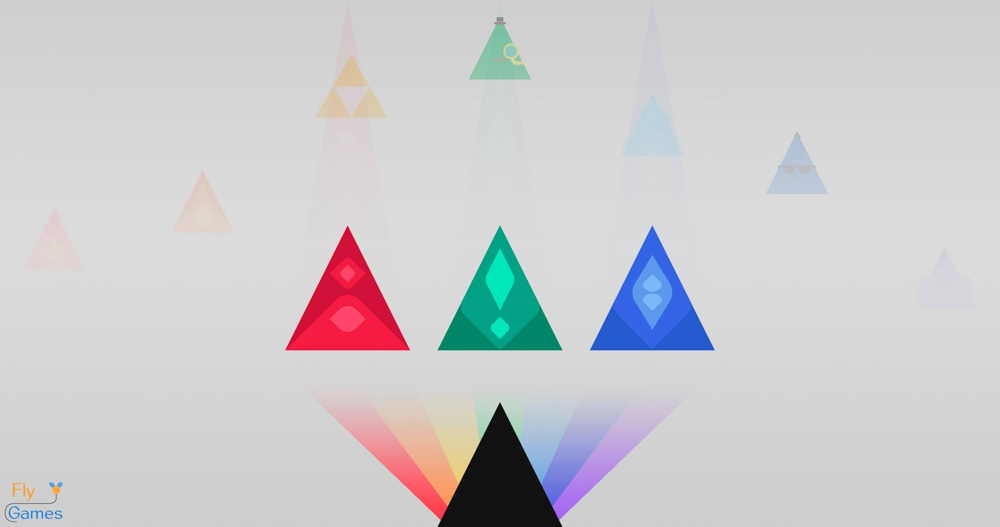

I'd had the Rainbow Triangle project around for a while. It was one of the few things I programmed in high school, and it made me feel pretty cool being able to make something like that.

It started in Macromedia Flash with ActionScript, with scenes, objects, and control over everything. **The physics system was the hardest part**: I could import physics engines, but I didn't like how they felt. I had to build my own physics engine, hunting down the gravity formula and tweaking parameters by hand.

On DeviantArt I posted game builds under the name [xentyo](https://www.deviantart.com/xentyo/gallery). This is the [**rTrian20150302 v3**](https://www.deviantart.com/xentyo/art/rTrian20150302-v3-517700649), with the original description: "Suggest, give your opinion, and tell me how much I suck. Everything is welcome." Haha, what an interesting way to put down my own work back then. I realize I was already a perfectionist. I believed everything had to come out perfect, and showing myself to the world was... wow! Looking back now it's like... an achievement.

<figure style="margin:0;">

<figcaption style="font-size:0.85rem; color:var(--text-faint); text-align:center; margin-top:4px;">Build rTrian20150302 v3 on DeviantArt, March 2015</figcaption>
</figure>

Later I moved it to Unity. Back then I understood that Unity only supported C#, so that was my first contact with the language.

<figure style="margin:0;">
<video controls src="../assets/rainbow-triangle-mi-juego_v0.mp4" style="width:100%; max-height:600px; border-radius:4px;"></video>
<figcaption style="font-size:0.85rem; color:var(--text-faint); text-align:center; margin-top:4px;">Video published on March 19, 2016</figcaption>
</figure>

Now it's built with C++ and published on [rt.chrislabs.net](https://rt.chrislabs.net). I remade it because I couldn't find the original files. You can play it right on the page:

  <iframe src="https://rt.chrislabs.net" title="Rainbow Triangle, a game published on rt.chrislabs.net" style="width:400px; height:800px; border:0; border-radius:4px;"></iframe>

## Concept art and lore

**I made it in Illustrator as concept art.** It's not something made for the game, it's more like the design of what the triangle could become.

Three colors: red, green, and blue. The master triangles that gave rise to the black triangle.

At that time I was adding lore to the game, a triangle-based world, and I planned to make it 3D. I also threw in some characters I was working on to integrate them.

**It wasn't very polished lore**, but I meant it. I even "founded" [Fly Games](https://devflygames.github.io/), even though I didn't know how to register it or anything.

<figure style="margin:0;">

<figcaption style="font-size:0.85rem; color:var(--text-faint); text-align:center; margin-top:4px;">Concept art published on May 7, 2016</figcaption>
</figure>

Because of a funny breakup and some things that happened, I never finished it or kept going. Sometimes it seems like this is the whole story of me, but there are many more things I did after.

**I hope something in my current skills lets me make it**, putting all that experience and all that sincerity into the game. Who knows.
