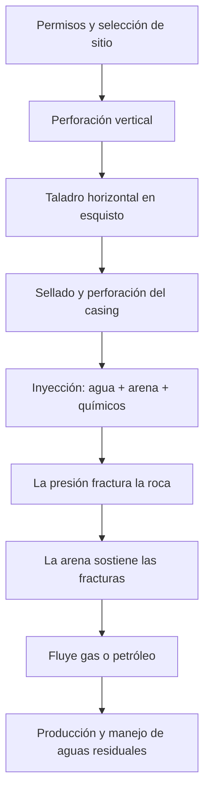
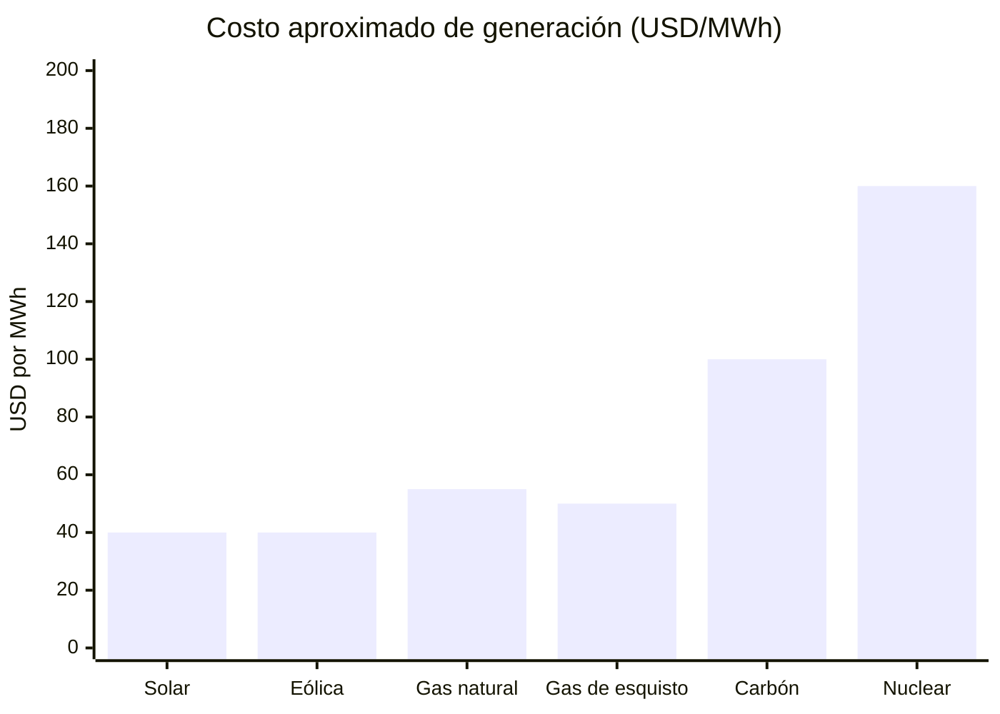
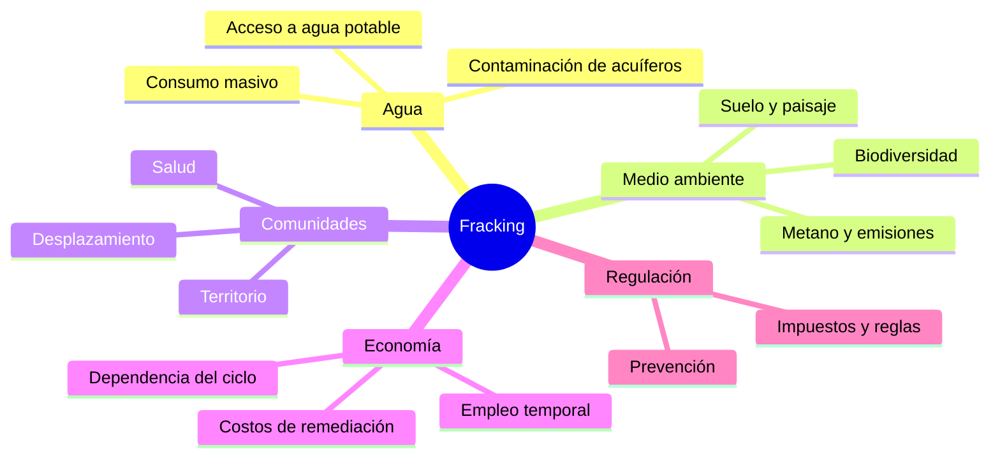

<video controls src="../assets/mooh-kemouche-11y-reply-see-trans_v0.mp4" style="width:100%; max-height:600px; border-radius:4px;"></video>

No sé cómo llegué a [este post](https://www.facebook.com/watch/?v=10153054829609308). Supongo que seguía alguna página de Photoshop, pero por alguna razón me salió como que lo compartí. Habla del [fracking](https://es.wikipedia.org/wiki/Fracturaci%C3%B3n_hidr%C3%A1ulica), un tema que se discutía bastante en 2015 porque lo querían implementar en México.

Hace poco el canal CuriosaMente subió otro video sobre lo mismo: [¿Cómo funciona el fracking? ...y cuáles son sus consecuencias](https://www.youtube.com/watch?v=7RpEBwr0IeU). **Ya pasaron 11 años desde este post y el fracking sigue sin resolverse.**

Lo importante aquí es conocer. Más allá de actuar o prohibir, hay que saber qué es el fracking y qué implica. Sin eso, la discusión se queda en eslogan.

## Cómo funciona el fracking

Son pasos técnicos claros, no un eslogan. Del permiso a la producción:

## El costo frente a otras fuentes

No es la opción más barata. El gráfico usa órdenes de magnitud en USD por MWh; los rangos varían por región y año:

## Lo que el fracking toca

El pozo es solo el principio. Qué queda en la misma red:

## Mi propuesta

El fracking no debería ocurrir. Pero **prohibirlo no basta**: la tecnología ya existe y la idea también. Si llega una crisis y es la única solución, un veto total solo nos quita tiempo.

Propongo legislar para esos casos: crisis o uso diario, con reglas claras. No sé legislar, lo confieso. El gobierno suele prohibir y acomodar las reglas para que las empresas ganen. El primero que llega escribe las reglas.

Si ellos ya llegaron, hay que inyectar desde nuestro lado las ideas de prevención. Que no se nos quite el acceso al agua potable ni a las comunidades. Eso, como mínimo.
