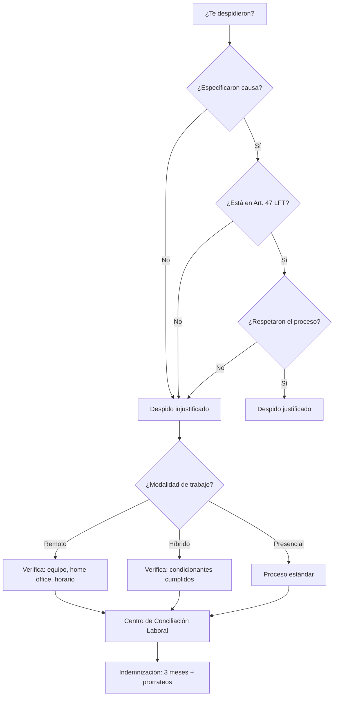

Me cambiaron las prioridades. No en el sentido corporativo bonito de "pivotar estratégico", sino en el de sentarte un lunes y que te digan que tu proyecto ya no existe.

Trabajaba en [ArkusNexus](https://www.arkusnexus.com/), una consultora de tecnología. Llevaba año y siete meses en el proyecto [Drata](https://drata.com/), y por primera vez en mucho tiempo me sentía estable. Ya entendía el proyecto, las tecnologías, la dinámica con el equipo y con la consultora. Estaba en esa etapa cómoda donde sabes moverte, donde ya no preguntas cosas básicas, donde tienes la libertad para hacer cosas sin pedir permiso.

Y de repente: **"Ahora eres equipo de research."** Sin aviso, el lunes a primera hora tenía la noticia. Un día estás construyendo y al siguiente te dicen que tu función ya no es la misma. Acepté porque no me quedaba otra. Personas que yo creía que se iban a quedar en el equipo resultó que no. Se hizo un desbarajuste total y el ambiente se volvió insostenible.

**A los pocos días vino el despido.** Injustificado, sin premisa real. Lo primero que hice fue investigar cuánto me correspondía por ley. En México, cuando te despiden injustificadamente, tienes derecho a una **indemnización** que incluye tres meses de salario, prorrateo de aguinaldo, vacaciones y prima vacacional, entre otros conceptos. Al final me dieron como dos terceras partes de lo que realmente me tenían que dar. Estaba encabronado. Quería hacer un desmadre, pero no sabía por dónde empezar.

Para entender qué pasó, hay que saber que en México la Ley Federal del Trabajo<a href="#lft-ref" class="footnote-ref">1</a> distingue entre despido justificado e injustificado. No es lo mismo que te despidan por faltar o por robar a que te despidan sin decirte por qué. Y en el contexto de consultoras de software, donde muchos trabajamos remoto o híbrido, la cosa se complica:

Llegué a ir al **Centro de Conciliación Laboral** en Tijuana a recibir asesoría. Ahí me explicaron qué correspondía y qué no, y me hicieron un cálculo rápido. Los números no cuadraban. También hubo retrasos en los pagos de liquidación, y la empresa estaba despidiendo a mucha gente al mismo tiempo. Todo era un caos.

Recuerdo que me habían pedido la máquina de la empresa. Yo trabajaba remoto la mayoría del tiempo. Se la llevé en la fecha que acordamos, sin problema. Pero el proceso en sí me cambió las prioridades de golpe. Pasé de tener un salario estable con planes claros a tener que rearmar todo: el ahorro para la casa se congeló, los planes se pospusieron. **Lo único que alcanzé a comprar fue un carro.** Me ha ayudado bastante hasta la fecha.

De ese proceso saqué algo que después le sirvió a alguien más. Hice una hoja de cálculo en Excel basada en lo que me habían explicado en el Centro de Conciliación Laboral, con las fórmulas para calcular cuánto te correspondía en un despido injustificado según la Ley Federal del Trabajo<a href="#lft-ref" class="footnote-ref">1</a>. Un año después, un compañero la usó para defenderse en un caso similar. Y le funcionó.

A los 5 meses conseguí el siguiente trabajo de una forma que no esperaba. No fue por LinkedIn, fue porque publiqué en WhatsApp Stories. **Una jugada de ajedrez que salió bien.**

Fue un cambio de prioridades total. No del tipo bonito que ponen en las charlas de motivación, sino del que te obliga a rearmar todo lo que tenías planeado y aprender a moverte con lo que tienes. A veces el golpe es lo que te hace recalcular qué importa de verdad.

<small>[1] <a href="https://www.diputados.gob.mx/LeyesBiblio/pdf/LFT.pdf" target="_blank" rel="noopener noreferrer nofollow">Ley Federal del Trabajo — Cámara de Diputados, texto vigente</a></small>

