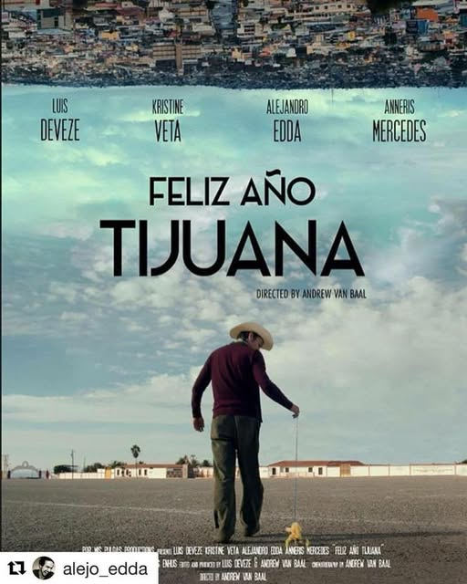

**Esta era una de mis primeras intenciones de promover la cultura de Tijuana.** República del estreno de Feliz Año Tijuana en la Cineteca CECUT, compartida de [Dulce Vázquez](https://www.facebook.com/dulce.vazquezm/posts/pfbid02NmmGRpWGvXU95nZt44kA4ZoEUrZoiPnNwvTS7E6jWGTZDq42F5UVeC2c9rDTPV2vl).

Nunca se proyectó en nada que pudiera llevarlo más allá. Mis intenciones se quedaron en compartir, en republicar. **Nunca llegué a que mis manos hicieran algo más.**
