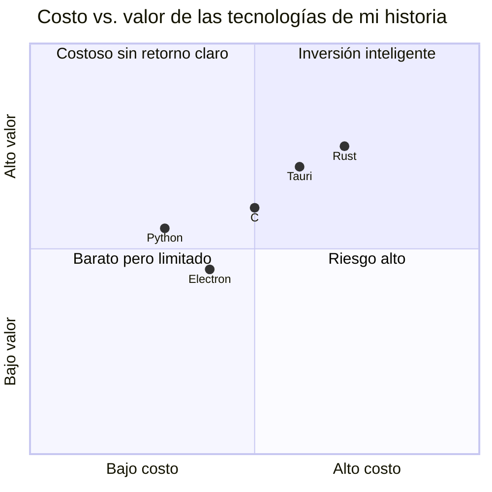
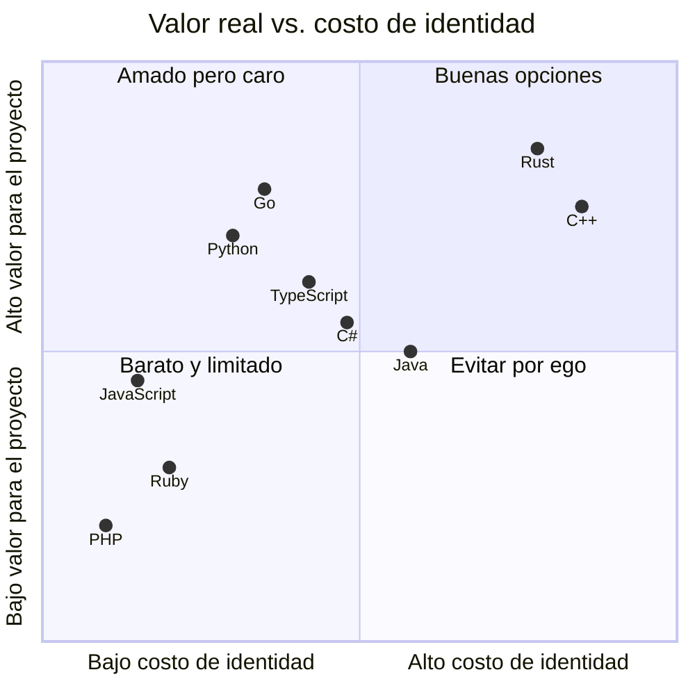

C'est un post que je planifie d'écrire depuis longtemps, parce que c'est un problème qui apparaît chaque fois qu'on crée un nouveau projet. Quel langage j'utilise ?

La première pensée qui me vient n'a rien à voir avec les langages en soi. Elle a à voir avec ce qu'on fait avec eux. **Au final, ce sont des technologies qui t'aident à transformer l'information qui entre et sort de ton système.** C'est tout.

## La fois où j'ai choisi Rust par l'ego

J'ai reçu un projet pour un hôtel : signer des cartes [NFC](https://nfc-forum.org/learn/nfc-technology/) et leur donner accès aux chambres. Le développeur précédent les faisait payer cher pour le support, et l'idée était de réduire le coût. C'était : moi contre le gars qui voulait continuer à faire le support.

[Tauri](https://v1.tauri.app/) était en développement à ce moment-là et promettait que les apps desktop seraient plus légères que celles d'[Electron](https://www.electronjs.org/). Il tenait ses promesses. Mais ce qui m'a poussé à le choisir au-delà de la promesse, je pense, c'était l'ego. **Je voulais utiliser le plus grand nombre de langages possible.** Être programmeur faisait partie de mon identité de développeur, de personne. Avec cinq ans d'expérience, mais avec une attitude très junior.

[Rust](https://rust-lang.org/) était le bon choix sur le papier. [Tauri](https://v1.tauri.app/) sort une app desktop légère, le langage est solide, la communauté grandit. Tout va bien.

Mais je suis tombé sur un problème que [Rust](https://rust-lang.org/) ne résolvait pas : j'avais besoin d'un sidecar qui tourne à côté d'[Arduino](https://www.arduino.cc/) pour lire le port COM. Étape de développement, loin de la production, mais réel. J'ai dit "ben je fais tourner le code [C](https://www.c-language.org/) avec l'app desktop". C'était une bonne option sur le papier.

Ça n'a pas marché comme prévu. Dans [VS Code](https://code.visualstudio.com/), j'avais beaucoup de problèmes pour faire tourner le sidecar. Au final, j'avais un script en [Python](https://www.python.org/) pour monter le bundle : l'app de [Tauri](https://v1.tauri.app/) avec le sidecar qui lisait le port COM et tout ce qui vient après pour gérer les microcontrôleurs. Je formais aussi un collègue récemment arrivé en [Rust](https://rust-lang.org/), [Svelte](https://svelte.dev/), [Arduino](https://www.arduino.cc/) et plusieurs technologies.

**Ça a fini par être un amalgame de technologies.** Tout pour le coût d'essayer d'apprendre un nouveau langage au lieu de réduire le coût d'implémentation.

## Le choix comme identité

Cette expérience m'a bien fait comprendre un truc : le choix d'un langage devient une question d'identité. "Je suis programmeur en [Python](https://www.python.org/)", "je fais du [Rust](https://rust-lang.org/)", "[Go](https://go.dev/) c'est le seul qui vaut quelque chose". On se met des étiquettes comme si elles faisaient partie de qui on est.

Steve Francia a écrit deux posts là-dessus en novembre 2025 : [Why Engineers Can't Be Rational About Programming Languages](https://spf13.com/p/the-hidden-conversation/) et [The 9 Cost Factors](https://spf13.com/p/the-9-factors/). Dans le premier, il explique que toute discussion sur les langages a deux conversations en même temps : la visible (features, benchmarks, types) et la invisible (identité, ego, appartenance). La invisible gagne presque toujours.

Son point n'est pas nouveau, mais c'est bien dit : **la bonne décision n'est pas celle qui te fait te sentir mieux comme ingénieur, c'est celle qui convient au projet.**

## Alors, comment on choisit ?

Si on sort l'identité de l'équation, la question se simplifie : quelle information transforme mon système, et quel outil me convient pour ça ?

Les 9 facteurs de Francia se regroupent en trois domaines :

- **Construire** : à quelle vitesse tu écris, à quel point le code scale facilement, combien de temps il faut à un nouveau pour être productif
- **Exécuter** : combien ça coûte à maintenir, combien ça consomme en runtime, à quelle vitesse tu déploies
- **Externes** : comment ça interagit avec d'autres outils, à quel point ça marche bien avec l'assistance IA, à quel point l'écosystème est sûr

Aucun de ces facteurs ne dit "ce langage est le meilleur". Tous disent "ce langage coûte X dans ces conditions".

## En pratique

Quand tu démarres un nouveau projet, avant d'ouvrir le débat sur le langage, réponds à ça :

1. Quelle information entre et sort de mon système ?
2. À quelle vitesse j'ai besoin d'avoir quelque chose qui tourne ?
3. Qui d'autre va travailler là-dessus ?
4. Combien ça coûte de maintenir ça dans un an ?

Les réponses te rapprocheront plus de la bonne décision que n'importe quel benchmark que tu trouveras sur internet.

Je ne dis pas que le choix est trivial. Je dis que ça ne devrait pas être une discussion sur qui a raison. **C'est une décision économique, et les décisions économiques se prennent avec des données, pas avec de l'ego.**

Ce que Steve appelle la "conversation invisible" est réel, et ça travaille contre toi même quand tu crois être rationnel. La prochaine fois que quelqu'un (ou toi) défend un langage avec passion, demande-toi : est-ce que j'évalue un outil, ou est-ce que je défends une version de moi-même ?

## Les langages avec lesquels on s'identifie

Voici les langages où le plus de développeurs ont formé une identité, positionnés par leur valeur réelle quand tu réponds aux 4 questions ci-dessus :

Le coût d'identité, c'est ce que te coûte la décision quand tu laisses l'ego parler à la place des données : temps d'apprentissage, recrutement difficile, maintenance complexe, ou simplement la frustration de forcer un outil là où il ne s'intègre pas.

**Rust et C++ donnent une haute valeur, mais ça coûte cher en identité** (courbe d'apprentissage, talent rare). Go et Python sont dans la zone où le coût justifie le retour si les questions ci-dessus sont bien répondues. C# et Java sont le terrain enterprise : écosystème mature, outils solides, valeur prévisible. PHP et Ruby ne se justifient que si le projet est déjà attaché à eux.

La position n'est pas universelle. Elle change selon ton projet, ton équipe et ton système. **C'est juste un exercice pédagogique**, ma façon de voir les choses à cet instant précis, pas une loi ni une vérité absolue. C'est un blog, après tout. Et oui, peut-être que j'agis avec mon ego en positionnant l'un ou l'autre plus bas ou plus haut que ce que je voudrais. C'est exactement le point.
