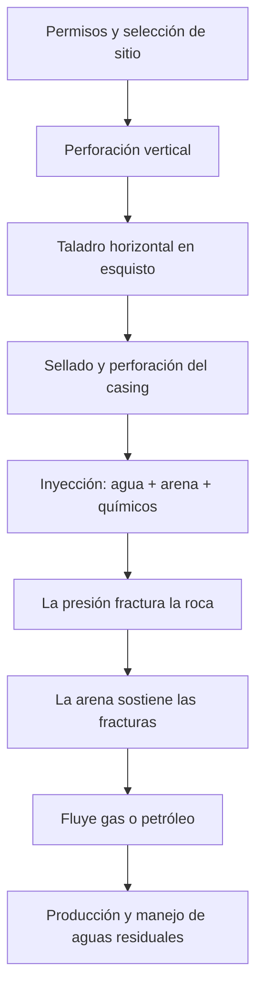
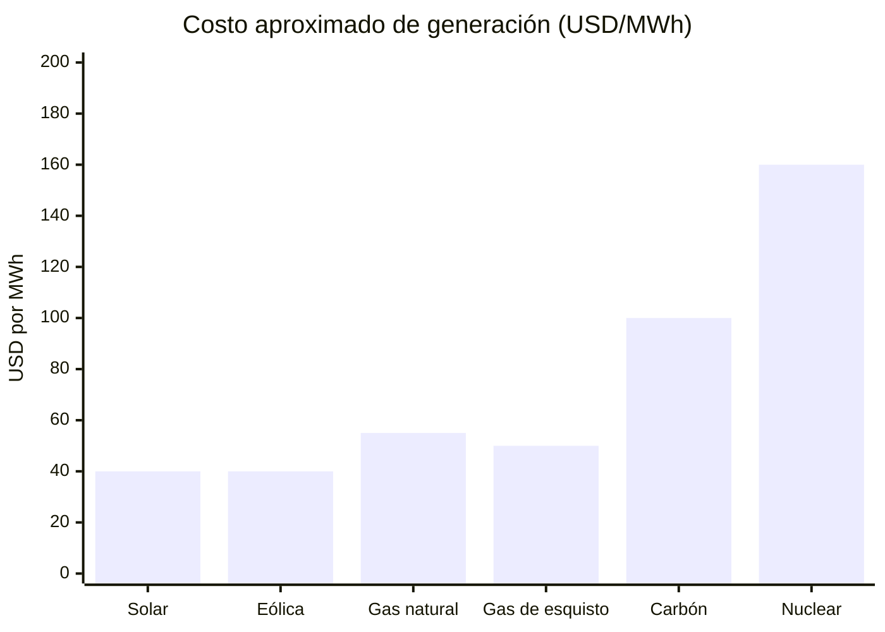
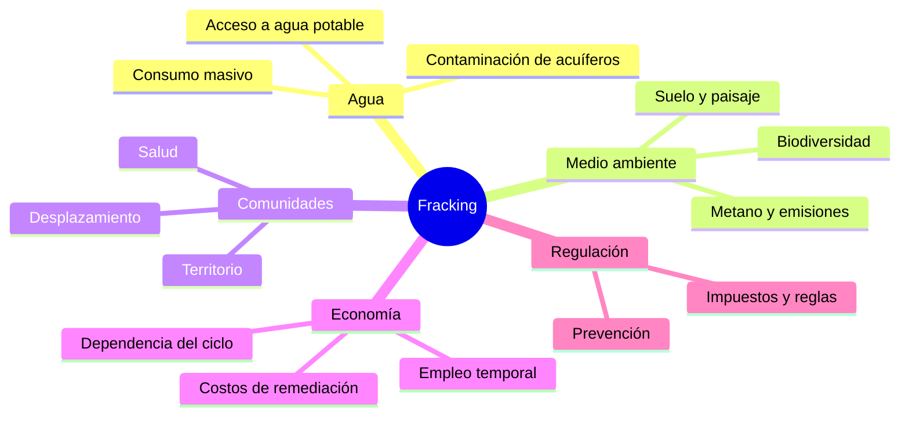

<video controls src="/static/posts/mooh-kemouche-11y-reply-see-trans_v0.mp4" style="width:100%; max-height:600px; border-radius:4px;"></video>

Je ne sais pas comment je suis tombé sur [ce post](https://www.facebook.com/watch/?v=10153054829609308). Je suppose que je suivais une page Photoshop, mais pour une raison quelconque il est apparu comme si je l'avais partagé. Ça parle du [fracking](https://es.wikipedia.org/wiki/Fracturaci%C3%B3n_hidr%C3%A1ulica), un sujet qu'on discutait beaucoup en 2015 parce qu'on voulait l'implémenter au Mexique.

Récemment, la chaîne CuriosaMente a monté une autre vidéo sur le même sujet : [Comment fonctionne le fracking ? ...et quelles sont ses conséquences](https://www.youtube.com/watch?v=7RpEBwr0IeU). **Ça fait déjà 11 ans depuis ce post et le fracking n'est toujours pas résolu.**

L'important ici, c'est de savoir. Au-delà d'agir ou d'interdire, il faut savoir ce qu'est le fracking et ce que ça implique. Sans ça, la discussion reste au niveau de slogan.

## Comment fonctionne le fracking

Ce sont des étapes techniques claires, pas un slogan. De l'autorisation à la production :

## Le coût face aux autres sources

Ce n'est pas l'option la moins chère. Le graphique utilise des ordres de grandeur en USD par MWh ; les fourchettes varient selon la région et l'année :

## Ce que le fracking touche

Le puits n'est que le début. Ce qui reste dans le même réseau :

## Ma proposition

Le fracking ne devrait pas avoir lieu. Mais **l'interdire ne suffit pas** : la technologie existe déjà, et l'idée aussi. Si une crisis arrive et que c'est la seule solution, un veto total ne nous fait que perdre du temps.

Je propose de légiférer pour ces cas-là : crisis ou usage quotidien, avec des règles claires. Je ne sais pas légiférer, je l'avoue. Le gouvernement a tendance à interdire et à arranger les règles pour que les entreprises gagnent. Le premier arrivé écrit les règles.

S'ils sont déjà arrivés, il faut injecter de notre côté les idées de prévention. Qu'on ne nous enlève ni l'accès à l'eau potable ni l'accès aux communautés. Ça, au minimum.
