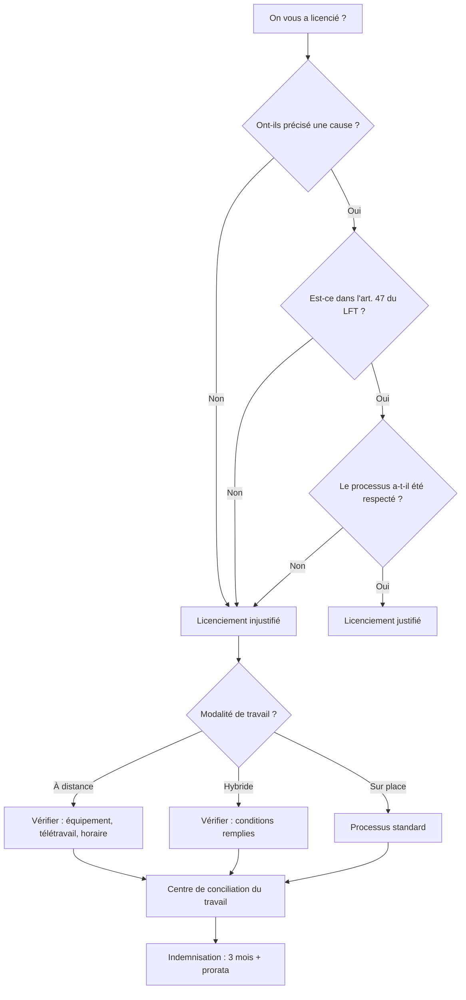

On m'a changé mes priorités. Pas dans le sens corporate agréable d'un « pivot stratégique », mais dans celui où tu t'assieds un lundi et qu'on te dit que ton projet n'existe plus.

Je travaillais chez [ArkusNexus](https://www.arkusnexus.com/), un cabinet de conseil en technologie. J'étais sur le projet [Drata](https://drata.com/) depuis un an et sept mois, et pour la première fois depuis longtemps je me sentais stable. Je comprenais déjà le projet, les technologies, la dynamique avec l'équipe et avec le cabinet. J'étais dans cette étape confortable où tu sais te déplacer, où tu ne poses plus les questions de base, où tu as la liberté de faire des choses sans demander la permission.

Et d'un coup : **« Maintenant tu es dans l'équipe recherche. »** Sans préavis, le lundi matin j'avais la nouvelle. Un jour tu construis, le lendemain on te dit que ton rôle n'est plus le même. J'ai accepté parce que je n'avais pas le choix. Des personnes que je croyais rester sur le projet n'y sont pas restées. Tout s'est démantelé et l'atmosphère est devenue insoutenable.

**Quelques jours plus tard est venu le licenciement.** Injustifié, sans cause réelle. La première chose que j'ai faite c'est de chercher ce à quoi j'avais droit selon la loi mexicaine. Au Mexique, quand on te licencie à tort, tu as droit à une **indemnisation** qui comprend trois mois de salaire, le prorata d'aguinaldo, les vacances et la prime de vacances, entre autres. À la fin ils m'ont donné environ les deux tiers de ce qu'ils me devaient réellement. J'étais fou de rage. Je voulais foutre le bordel, mais je ne savais pas par où commencer.

Pour comprendre ce qui s'est passé, il faut savoir que la loi fédérale du travail mexicaine<a href="#lft-ref" class="footnote-ref">1</a> distingue licenciement justifié et injustifié. Se faire virer pour vol ou pour absence n'est pas la même chose que se faire virer sans qu'on te dise pourquoi. Et dans le contexte des cabinets de conseil logiciel, où beaucoup travaillons à distance ou en hybride, la chose se complique :

J'ai fini par aller au **Centre de conciliation du travail** à Tijuana pour demander conseil. Là, ils m'ont expliqué ce à quoi j'avais droit et ce à quoi je n'avais pas droit, et ils m'ont fait un calcul rapide. Les chiffres ne collaient pas. Il y avait aussi des retards dans le versement de l'indemnisation, et la société licenciait beaucoup de monde en même temps. Tout était le chaos.

Je me souviens qu'on m'avait demandé l'ordinateur de l'entreprise. Je travaillais à distance la plupart du temps. Je l'ai rapporté à la date convenue, sans problème. Mais le processus lui-même a changé mes priorités d'un coup. Je suis passé d'un salaire stable avec des plans clairs à devoir tout reconstruire : l'épargne pour la maison s'est figée, les plans ont été reportés. **La seule chose que j'ai réussi à acheter c'est une voiture.** Elle m'a bien aidé depuis.

Quelque chose est sorti de ce processus qui a ensuite servi à quelqu'un d'autre. J'ai fait un tableur Excel basé sur ce qu'on m'avait expliqué au Centre de conciliation du travail, avec les formules pour calculer ce à quoi on a droit en cas de licenciement injustifié selon la loi fédérale du travail<a href="#lft-ref" class="footnote-ref">1</a>. Un an après, un collègue l'a utilisé pour se défendre dans un cas similaire. Et ça a marché.

Cinq mois plus tard j'ai trouvé le travail suivant d'une façon que je n'attendais pas. Ce n'était pas via LinkedIn, c'était parce que j'ai publié sur WhatsApp Stories. **Un coup d'échecs qui a payé.**

C'était un changement de priorités total. Pas du type agréable qu'on met dans les discours de motivation, mais de celui qui te force à reconstruire tout ce que tu avais prévu et à apprendre à te déplacer avec ce que tu as. Parfois le coup est ce qui te force à recalculer ce qui compte vraiment.

<small>[1] <a href="https://www.diputados.gob.mx/LeyesBiblio/pdf/LFT.pdf" target="_blank" rel="noopener noreferrer nofollow">Loi fédérale du travail — Chambre des députés, texte en vigueur</a></small>

